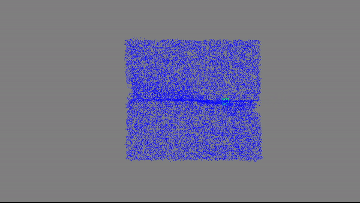
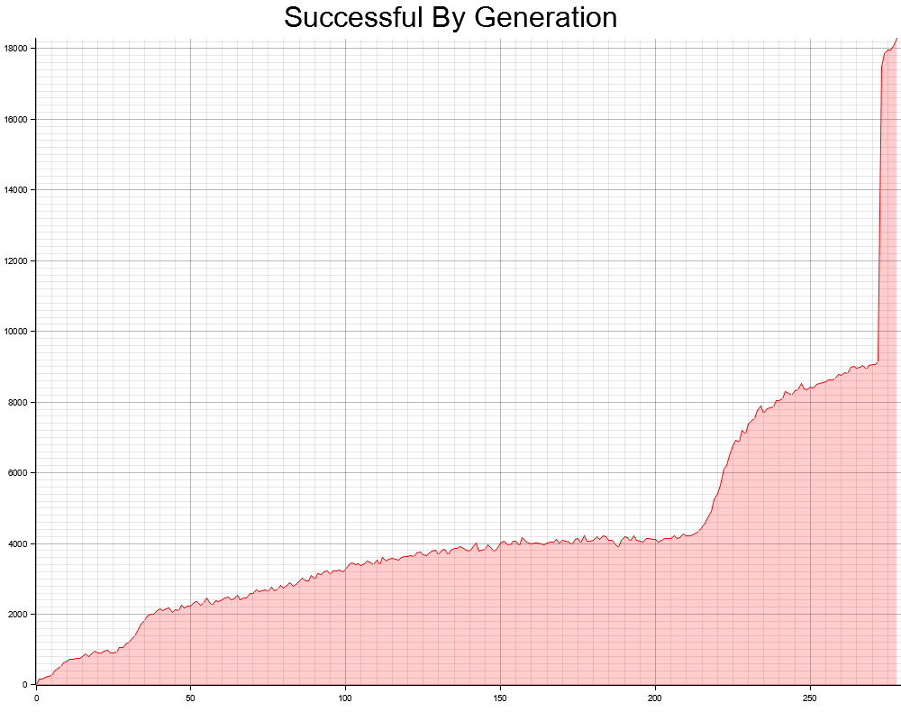
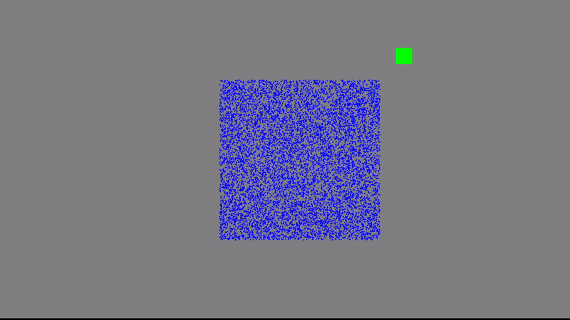
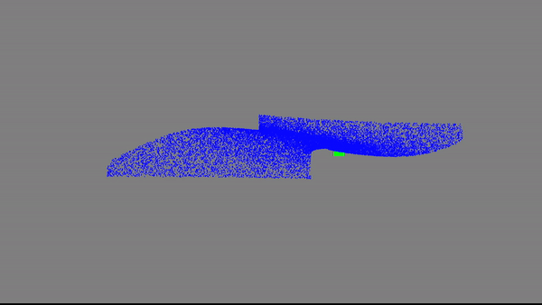

# LJKA my first AI project

This is my first dive into AI and machine learning, I tried creating a simple AI that learns to find a target on the screen. I created a neural network from scratch, and tried training it based on the survival of the fittest principle I guess.

## Examples

### 1. First Implementation of the AI

This is a real example of how the AI learns over time. Progress is slow overall, but every once in a while there is a sudden jump in performance. This is due to a random mutation that was very successful. It was able to get to around 90% success over 250 generations (Note: around 280 on the chart is not an increase in performance, but because all AI mutations were removed)

### 2. Adjusted the way the AI mutates and therefore learns

Notice how much faster this generation of ai learned. Additionally the target here is further away from the starting point, but they are still able to find it.

## Cool Looking Results

  
Note: This the program found by complete chance on the first generation, I didn't even know it was possible to get this result.

